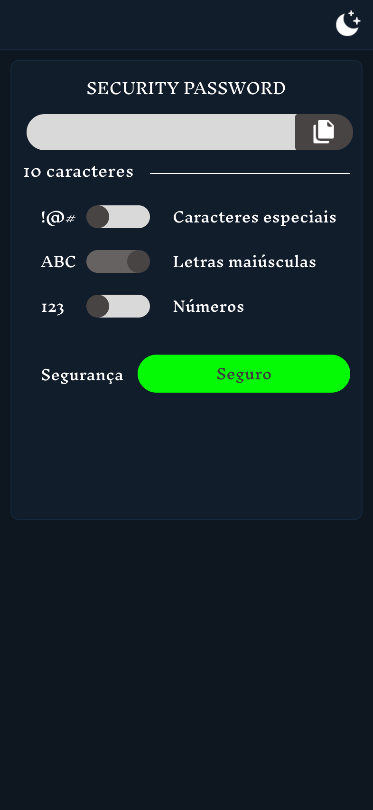
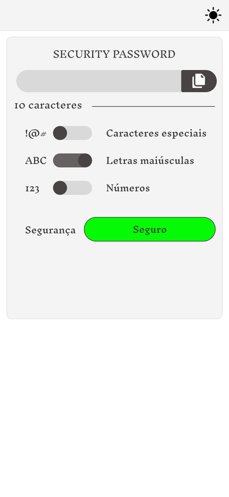

# Security Password

## Tecnologias e Ferranentas

- HTML5
- CSS3
- JavaScript
- Figma
- Cursor IDE

## Objetivo:

A criação de senhas fortes desempenha um papel essencial na segurança digital. Pensar em como criá-las de maneira eficaz e mantê-las seguras é, de certa forma, um desafio. Este projeto tem como objetivo gerar senhas personalizadas para os usuários, considerando suas preferências e critérios, e indicar o nível de segurança da senha criada com base nesses parâmetros.

## Style Guides

### Thema Dark

- background-color: #0E1620
- primary-color: #121D2B
- secudary-color: #D9D9D9
- border-color: #16283E
- gray-700: #666262
- gray-800: #484444
- text-color: #FFFFFF
- green-color: #05FB05
- yellow-color: #FBEF05
- red-color: #FF0000

### Thema Light

- background-color: #FFFFFF
- primary-color: #F4F4F4
- secudary-color: #D9D9D9
- border-color: #E4E0E0
- gray-700: #666262
- gray-800: #484444
- text-color: #3F3D3D
- green-color: #05FB05
- yellow-color: #FBEF05
- red-color: #FF0000

## Design Figma

### Mobile

